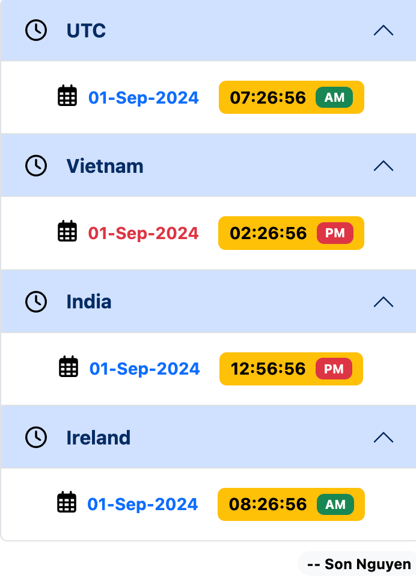

# Chronos Time - Time Zone Converter Extension

Chronos Time is a beautiful and interactive browser extension that helps you keep track of the current time across multiple countries and time zones.

## Features

- **Real-time Clock:** View live time for various locations.
- **Interactive Converter:** Use the slider to convert time between different time zones easily.
- **12h/24h Format:** Toggle between 12-hour and 24-hour time formats.
- **Search & Add:** Quickly search and add from a vast list of global cities and time zones.
- **Copy to Clipboard:** Copy formatted time details with a single click.
- **Clean UI:** Modern design with glassmorphism effects and high-quality typography.

## Installation

1. Clone the repository.
2. Open your browser's extension management page (e.g., `chrome://extensions`).
3. Enable "Developer mode".
4. Click "Load unpacked" and select the extension directory.

## Technologies Used

- JavaScript (ES6+)
- [Moment.js](https://momentjs.com/) & [Moment Timezone](https://momentjs.com/timezone/)
- [Bootstrap 5](https://getbootstrap.com/)
- Google Fonts (Plus Jakarta Sans)

## Author

Crafted by **Son Nguyen**.

---

